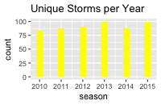
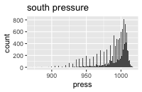
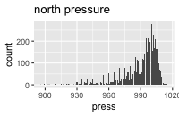
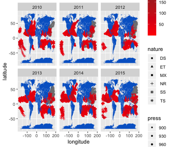
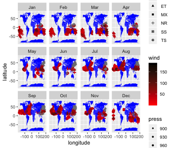
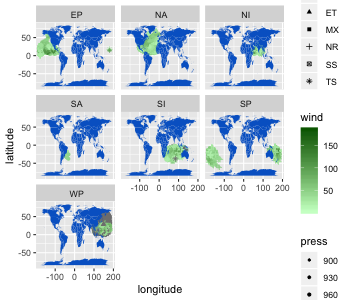
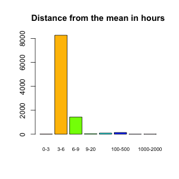

workout1-yuelin-zhou
================
yuelinzhou

    ## 
    ## Attaching package: 'dplyr'

    ## The following objects are masked from 'package:stats':
    ## 
    ##     filter, lag

    ## The following objects are masked from 'package:base':
    ## 
    ##     intersect, setdiff, setequal, union

    ## 
    ## Attaching package: 'lubridate'

    ## The following object is masked from 'package:base':
    ## 
    ##     date

## Question 1: What is the number of (unique) storms in each year?

Storm is a large variety of atmospheric disturbances (bad weather) comes
from rain and snowstorms to thunderstorms and some other wind-related
disturbances.Given a storm occur in certain time interval, we have a
name for it, for example, ANJA, BONGANI,CLEO and so on. These name can
also appear again in any given time in each year. Recenlty we had the
datas record from 2010~2015 on all storms, we are intrested to find the
number of unqiue storms in each year. Based on the garph we filtered,
there’s about 80 unqiue storms in 2010, slightly more in 2011 and 2012,
the maximun number is at 2013, which has about 100 unqiue storms, for
2014, it goes down a liitle bit, for 2015 it goes up again. Overall they
are pretty close to each other, no extreme big different between two
seasons.


## Question 2: What is the total number of storms per hemisphere?

There’s 2 hemisphere (north and south). The north heimsphere is the top
half of earth on the Equator.The region around the North Pole so, it’s
between the latitude range of 0 ~ 90 degree.The south heimsphere is the
bottom half of earth under the Equator, it’s between the latitude range
of -90 ~ 0 degree.Based on the data of storms, I saw that there’s 12703
storms in north hemisphere and 5572 storm in south heimsphere.

``` r
# This is the total number of storms in the north hemisphere
nrow(select(filter(dat,latitude >0 &latitude <= 90),latitude))
```

    ## [1] 12703

``` r
# This is the total number of storms in the south hemisphere
nrow(select(filter(dat,latitude < 0 & latitude >= -90),latitude))
```

    ## [1] 5572

## Question 3: Do storms tend to occur more often in one hemisphere than in the other?

Yes, storms tend to occur more often in north than south based on the
previous question. Why? let’s find out some reasons.The first reason is
Low-Pressure Systems,In the North Hemisphere, the storms spin
counter-clockwise and because of the earth rotates to the east, reuslted
a lot of winds or low pressure air and storms are focus on the path to
north instead south. therefore, north has more storm than south. Below
is the picture shows how north pressure is lower than south presssure.

Based on the graph, we can see that more high press air data lines on
the south.(see the counts)

The second reason is Milder Climate.Since the South Hemisphere has
significantly more ocean and much less land, which means water heats up
and cools down more slowly than land.we can conclude that north is
colder than south, also inplies north has higher chance of causing
storms.

## Question 4: Do storms tend to occur uniformly throughout the year (evenly amount of storms per month)? Or are there months where there’s more storm activity?

Here’s the pictcure all storms throughout the year and month

Based on the first picture of all storms throughout the year, it looks
like storms are tend to occur uniformly because the points are not that
much different for each year. Althought 2010 might seems more storms
than other year, but overall, the shape still looks the same. The second
picture of all stoms throughout by month is not uniformly distributed
because we can see that there’e less storms around (May to June) and
more storms around (September to October). Also from January to April,
the storms activaity tend to focus on the south heimisphere, from May to
Oct, the storms goes up to the equator line. After Oct, the storms start
going back down.

I think faceting by month is easier to see the dynamic and the flows of
the storms throught out the, I use the color from low as red to high as
black to label the wind speed, most of the big stroms are lies on
october and focus on US, so we should be aware of
that.

## Question 5: Is there a particular Basin where storms occur more frequently? Or are there basins without much storm activity?


Based on the picture above, I discovered that EP, NA and WP where storms
occur more frequently. As I search up on google, the reason is becuse
they are all close to the sea, therefore the wind goes faster and easier
to have storms. same for NI and SA, they are close to the lane,
therefore less storms will occur.This is intresting to know because we
can aviod living in the place with more storms, so that your life is
saved, haha. Below is the table about number of storms by basin.

    ## 
    ##   EP   NA   NI   SA   SI   SP   WP 
    ## 3493 2858 1465   49 4132 2040 5958

As we can see, there’s more number in WP compare to
SA

## Question 6: what is the typical duration of a storm (e.g. in terms of hours, or days)?

The typical duration of a storm in seconds is

    ## [1] 34525.51

The typical duration of a storm in hours is

    ## [1] 9.59042

The typical duration of a storm in days is

    ## [1] 0.3996009

Based on the result, I will conclude that the typical duration of a
storm is roughly 10 hours, this is intersting to know because you can
expect how long the storms will end and increase your comment
sense.

## Question 7:Are there storms with durations that deviate considerably from the typical duration?

Given that we have the typical duration of a storm in hours is

    ## [1] 9.59042

The barplot shows storm distances of time away from the mean

Based on the graph, the average distance of storms time away from the
mean is 3-6, in other words we should expect the duration around 3-6
range for every time when storms occur. There’s still some extreme large
distance to the typtical duration in 1000-2000 hours and few hundreds of
storm duration that is between 9-20hours, 20-100 hours, since the data
is large enough thoese value can consider as outliers.

And finally the standard devaiation is (extra information), which is not
a good appoximation on this situation because we have a lot of extreme
large distance
value.

    ## [1] 38.84815

## Question 8: What is the top-10 list of storms in terms of high wind speed values?

The top 10 list of storms has

    ## 
    ## 112 115 120 125 130 135 140 150 180 185 
    ##   1 102  48  33  19  11   3   1   2   1

As we can see most of the wind speed in the top-10 list lies on the wind
speed on 115 knots,the max top 10 speed is 185 knots, and the min of top
10 speed is 112 knots, which is still very fast. As we know that the
higher wind speed , the bigger storms that occurs, I noticed that the
top-10 storms are mostly focus on the location on EP, which is pretty
close to Eastern Pacific and more specifictly California bay area,
therefore, we should expect some bigger storms occurs on the bay area.
This is interesting to know because we are living in east bay, berkeley,
which is 10-20 miles away from the main bay area land “San Francisco”.

some extra information about the top\_10 storms is the maxium top\_10
storms with 185 knots, It takes place in EP named PARTICA in oct,2015.
Based on my research it’s the strongest hurricane on record in either
the eastern Pacific or Atlantic Ocean basins and more than 1000 homes
were damaged or destroyed and about 100,000 acres of farmland suffered
damage. which is a very intersting fact to know.
